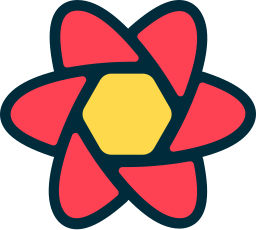
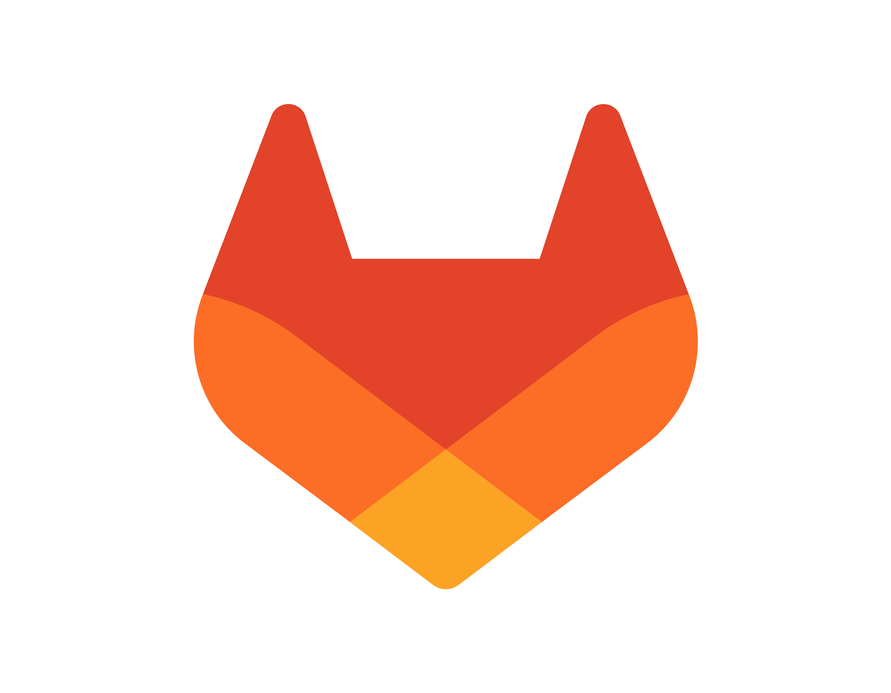
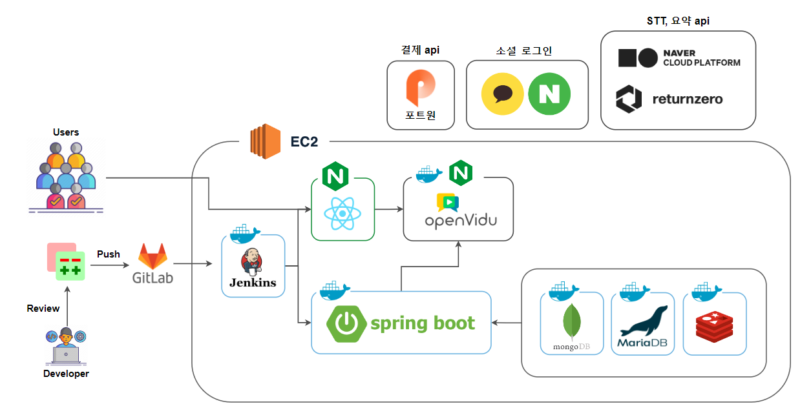
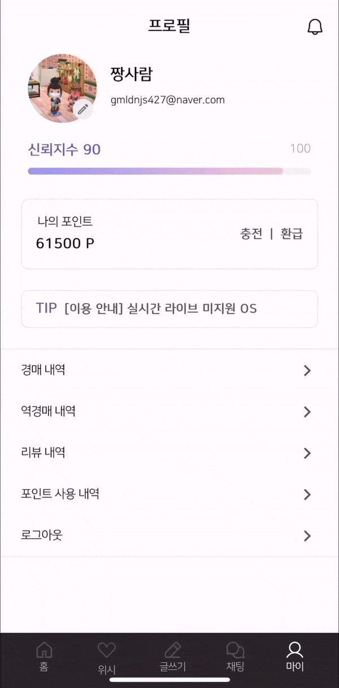
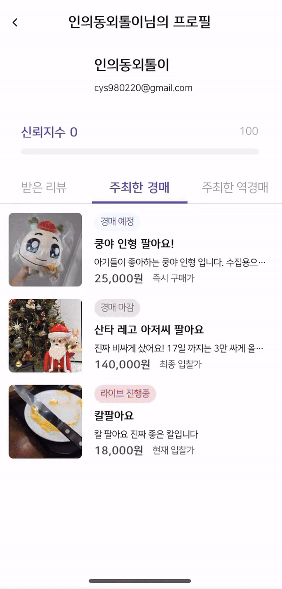

<div align="center">
  <br />
  
  <br />
  <h2>쉽고 합리적 거래를 위한 개인경매 서비스, BID</h2>
  <a href="https://i10d208.p.ssafy.io/">
   
  </a>
  <a href="https://www.notion.so/lshhh/BiD-ca99ff12c71748068f7e74a0bb251f32">
   
  </a>
    <a href="https://www.figma.com/file/knk5KBreUoQ7YTtvf88BXt/BID?type=design&node-id=83-402&mode=design&t=BRWoYwTzhVq1MUnM-0">
   
  </a>
  <a href="http://i10d208.p.ssafy.io:8081/api/swagger-ui/index.html">
   
  </a>

<b>SSAFY 공통 PJT TEAM 928</b>

<p align='center'>
    <a href="https://hits.seeyoufarm.com">
    </a>
</p>
  
<br />

</div>

## 목차

1. [**웹 서비스 소개**](#1)
1. [**기술 스택**](#2)
1. [**주요 기능**](#3)
1. [**프로젝트 구성도**](#4)
1. [**서비스 화면**](#5)
1. [**개발 팀 소개**](#6)
1. [**개발 기간 및 일정**](#7)
1. [**협업 컨벤션**](#8)
1. [**디렉터리 구조**](#9)
1. [**산출물**](#10)

 <!-- 1. [**실행 방법**](#8) -->

<br />

<div id="1"></div>

## ✨ 웹 서비스 소개

**BID**는 개인간 물품을 라이브 경매를 통해 합리적인 가격으로 쉽고, 빠르게 거래할 수 있는 서비스입니다. <br/>
BID를 사용하여 실시간 라이브를 통해 희망 거래 물건의 현재 상태를 미리 확인할 수 있습니다. <br/>
또한 경매 및 역경매를 통해 판매자와 구매자 모두 합리적인 가격에 거래 가능합니다. <br/>

### [BID 바로 가기](https://i10d208.p.ssafy.io/)

<br/>

<div id="2"></div>

## 🛠️ 기술 스택

### Frontend

<table>
  <tr>
    <td>
      <a href="https://www.tcpschool.com/html/html5_intro_intro" target="_blank"></a>
    </td>
    <td>
      <a href="https://www.w3schools.com/css/" target="_blank"></a>
    </td>
    <td>
      <a href="https://reactjs.org/" target="_blank"></a>  
    </td>
    <td>
      <a href="https://www.typescriptlang.org/" target="_blank"></a>  
    </td>
    <td>
      <a href="https://www.tailwindcss.com/" target="_blank"></a>
    </td>
  </tr>
  <tr align='center'>
    <td>HTML5</td>
    <td>CSS3</td>
    <td>React</td>
    <td>Typescript</td>
    <td>Tailwind<br/> CSS</td>
  </tr>
</table>

<table>
  <tr>
    <td>
      <a href="https://tanstack.com/query/latest/docs/framework/react/overview" target="_blank"></a>
    </td>
    <td>
      <a href="https://openvidu.io/" target="_blank"></a>
    </td>
    <td>
      <a href="https://stomp-js.github.io/" target="_blank"></a> 
    </td>
    <td>
      <a href="https://axios-http.com/kr/docs/intro" target="_blank"></a>
    </td>
    <td>
      <a href="https://zustand-demo.pmnd.rs/" target="_blank"></a>
    </td>
  </tr>
  <tr align='center'>
    <td>React<br/>Query</td>
    <td>Openvidu</td>
    <td>Stomp js</td>
    <td>Axios</td>
    <td>Zustand</td>
  </tr>
</table>

<table>
  <tr>
    <td>
      <a href="https://eslint.org/" target="_blank"></a>
    </td>
    <td>
      <a href="https://prettier.io/" target="_blank"></a>
    </td>
    <td>
      <a href="https://vitejs.dev/" target="_blank"></a>
    </td>
  </tr>
  <tr align='center'>
    <td>Eslint</td>
    <td>Prettier</td>
    <td>Vite</td>
  </tr>
</table>

<br/>

### Backend

<table>
  <tr>
    <td>
      <a href="https://www.java.com/" target="_blank"></a> 
    </td>
    <td>
      <a href="https://docs.spring.io/spring-framework/docs/3.0.x/reference/expressions.html#:~:text=The%20Spring%20Expression%20Language%20(SpEL,and%20basic%20string%20templating%20functionality." target="_blank"></a>   
    </td>
    <td>
      <a href="https://hibernate.org/" target="_blank"></a>  
    </td>
    <td>
      <a href="https://mariadb.org/" target="_blank"></a>  
    </td>
    <td>
      <a href="https://www.mongodb.com/" target="_blank"></a>
    </td>
  </tr>
  <tr align='center'>
    <td>Java</td>
    <td>Spring</td>
    <td>Hibernate</td>
    <td>Mariadb</td>
    <td>MongoDB</td>
  </tr>
</table>

<table>
  <tr>
    <td>
      <a href="https://redis.io/" target="_blank"></a>
    </td>
    <td>
      <a href="https://swagger.io/" target="_blank"></a>
    </td>
    <td>
      <a href="http://www.jasypt.org/" target="_blank"></a>
    </td>
    <td>
      <a href="https://spring.io/projects/spring-security" target="_blank"></a>
    </td>
    <td>
      <a href="https://openvidu.io/" target="_blank"></a>
    </td>
  </tr>
  <tr align='center'>
    <td>Redis</td>
    <td>Swagger</td>
    <td>Jasypt</td>
    <td>Spring<br/>security</td>
    <td>Openvidu</td>
  </tr>
</table>

<table>
  <tr>
    <td>
      <a href="https://stomp-js.github.io/" target="_blank"></a>
    </td>
  </tr>
  <tr align='center'>
    <td>Stomp js</td>
  </tr>
</table>

<br/>

### DevOps

<table>
  <tr>
    <td>
      <a href="https://aws.amazon.com/" target="_blank"></a> 
    </td>
    <td>
      <a href="https://www.docker.com/" target="_blank"></a> 
    </td>
    <td>
      <a href="https://www.nginx.com/" target="_blank"></a>  
    </td>
    <td>
      <a href="https://www.jenkins.io/" target="_blank"></a>  
    </td>
  </tr>
  <tr align='center'>
    <td>AWS</td>
    <td>Docker</td>
    <td>Nginx</td>
    <td>Jenkins</td>
  </tr>
</table>

<br/>

### Tools

<table>
  <tr>
    <td>
      <a href="https://www.notion.so/" target="_blank"></a>
    </td>
    <td>
      <a href="https://about.gitlab.com/" target="_blank"></a>
    </td>
    <td>
      <a href="https://www.atlassian.com/ko/software/jira" target="_blank"></a>  
    </td>
    <td>
      <a href="https://www.gerritcodereview.com/" target="_blank"></a>
    </td>
    <td>
      <a href="https://mattermost.com/" target="_blank"></a>
    </td>
  </tr>
  <tr align='center'>
    <td>Notion</td>
    <td>Gitlab</td>
    <td>Jira</td>
    <td>Gerrit</td>
    <td>Mattermost</td>
  </tr>
</table>

<br/>

<div id="3"></div>

## 💡 주요 기능

|           기능           | 내용                                                                                                                                                                  |
| :----------------------: | :-------------------------------------------------------------------------------------------------------------------------------------------------------------------- |
|    실시간 라이브 방송    | 경매와 역경매 글을 작성하고, 예정된 라이브 시간이 되면 실시간 라이브 서비스를 통해 자신의 물건을 판매, 구매 할 수 있습니다. 라이브 방송 중 채팅 또한 가능합니다.      |
|     실시간 1:1 채팅      | 즉시 구매나 낙찰을 통해 거래가 확정되면 1:1 채팅방이 생성되고 1:1 채팅을 통해 상대방과 대화할 수 있습니다.                                                            |
|       알림 서비스        | 관심있는 거래를 등록하고, 해당 거래의 라이브 방송 전 알림을 받을 수 있습니다. 또한 낙찰 및 상위입찰 발생 시에도 알림을 받을 수 있습니다.                              |
|       소셜 로그인        | 사용자는 네이버, 카카오 소셜 로그인을 통해 서비스에 가입할 수 있습니다.                                                                                               |
|           결제           | IamPort 결제 api를 활용하여 카카오페이 QR코드를 통해 사용자는 모의 포인트 충전을 진행할 수 있습니다.                                                                  |
|       경매글 조회        | 실시간 핫 경매, 마감 임박, 진행 예정 경매, 라이브 진행 중인 경매 등 인기 있는 경매들을 메인 화면에서 조회할 수 있습니다.                                              |
|        상세 조회         | 물건의 상세 정보를 조회할 수 있으며 라이브를 진행한 물품이라면 녹화영상, 타임 스탬프, STT를 적용한 라이브 요약본을 추가적으로 확인할 수 있습니다.                     |
| 카테고리 별 조회 및 검색 | 여러 사용자가 작성한 경매 및 역경매 글에 대해 다양한 필터를 제공하여 원하는 물품을 조회 할 수 있습니다. (카테고리별, 지역별, 경매시작전, 경매진행중, 라이브진행중 등) |
|       신뢰도 지표        | 사용자의 서비스 이용 내역에 따라 신뢰도 지표를 계산하여 거래 과정에서 서로의 신뢰도를 파악할 수 있는 기능을 제공합니다.                                               |

<br/>

<div id="4"></div>

## 📂 프로젝트 구상도



<br/>

<div id="5"></div>

## 🖥️ 서비스 화면

<table style="border: 2px; text-align:center;">
  <tr style="text-align:center;">
    <td> 회원가입 </td>
    <td> 메인페이지 </td>
    <td> 카테고리 및 필터링 기능 </td>
  </tr>
  <tr>
    <td>
      
    </td>
    <td>
      
    </td>
    <td> 
      
    </td>
  </tr>
</table>

<br/>

<table style="border: 2px; text-align:center;">
  <tr style="text-align:center;">
    <td> 검색 </td>
    <td> 알림 </td>
    <td> 위시 </td>
  </tr>
  <tr>
    <td>
      
    </td>
    <td>
      
    </td>
    <td>
      
    </td>
  </tr>
</table>

<br/>

<table style="border: 2px; text-align:center;">
  <tr style="text-align:center;">
    <td> 경매글 작성 </td>
    <td> 경매글 상세보기 </td>
  </tr>
  <tr>
    <td>
      
    </td>
    <td>
      
    </td>
  </tr>
</table>

<br />

<table style="border: 2px; text-align:center;">
  <tr style="text-align:center;">
    <td> 역경매글 작성 </td>
    <td> 역경매글 상세보기 </td>
  </tr>
  <tr>
    <td> 
      
    </td>
    <td>
      
    </td>
  </tr>
</table>

<br/>

<h4>경매 라이브</h4>
<table style="border: 2px; text-align:center;">
  <tr style="text-align:center;">
    <td> 가이드라인 </td>
    <td> 라이브 방송 </td>
  </tr>
  <tr>
    <td>
      
    </td>
    <td> 
      
    </td>
  </tr>
</table>

<br />

<h4>역경매 라이브</h4>
<table style="border: 2px; text-align:center;">
  <tr style="text-align:center;">
    <td> 발언권 신청 </td>
    <td> 매칭하기 </td>
    <td> 매칭 확정하기 </td>
  </tr>
  <tr>
   <td>
      
    </td>
    <td>
      
    </td>
    <td> 
      
    </td>
  </tr>
</table>

<table style="border: 2px; text-align:center;">
  <tr style="text-align:center;">
    <td> 라이브 채팅 </td>
  </tr>
  <tr>
    <td>
      
    </td>
  </tr>
</table>
<br />

<table style="border: 2px; text-align:center;">
  <tr style="text-align:center;">
    <td> 즉시구매 기능 </td>
    <td> 1:1 채팅 기능 </td>
    <td> 리뷰 작성 </td>
  </tr>
  <tr>
   <td>
      
    </td>
   <td>
      
    </td>
    <td>
      
    </td>
  </tr>
</table>

<br/>

<table style="border: 2px; text-align:center;">
  <tr style="text-align:center;">
    <td> 프로필 조회 </td>
    <td> 다른 유저 프로필 조회 </td>
    <td> 포인트 내역 조회 </td>
  </tr>
  <tr>
   <td>
      
    </td>
    <td>
      
    </td>
    <td> 
      
    </td>
  </tr>
</table>

<br/>

<div id="6"></div>

## 👨🏻‍💻 개발 팀 소개

<table>
<tr>
<td align="center">FE</td>
<td align="center">FE</td>
<td align="center">FE</td>
<td align="center">BE</td>
<td align="center">BE</td>
<td align="center">BE</td>
</tr>
  <tr>
    <td align="center" width="120px">
      <a href="https://github.com/rosielsh" target="_blank">
        
      </a>
    </td>
    <td align="center" width="120px">
      <a href="https://github.com/hyun812" target="_blank">
        
      </a>
    </td>
    <td align="center" width="120px">
      <a href="https://github.com/minnnnnk0" target="_blank">
        
      </a>
    </td>
    <td align="center" width="120px">
      <a href="https://github.com/HeewonYoun" target="_blank">
        
      </a>
    </td>
    <td align="center" width="120px">
      <a href="https://github.com/Henry-Cha" target="_blank">
        
      </a>
    </td>
    <td align="center" width="120px">
      <a href="https://github.com/TutiTuti" target="_blank">
        
      </a>
    </td>
    
  </tr>
  <tr>
    <td align="center">
      <a href="https://github.com/rosielsh" target="_blank">
        이수화
      </a>
    </td>
     <td align="center">
      <a href="https://github.com/hyun812" target="_blank">
       이승현
      </a>
    </td> 
     <td align="center">
      <a href="https://github.com/minnnnnk0" target="_blank">
       최민경
      </a>
       <td align="center">
      <a href="https://github.com/HeewonYoun" target="_blank">
        윤희원
      </a>
    </td>
     <td align="center">
      <a href="https://github.com/Henry-Cha" target="_blank">
       차성원
      </a>
    </td> 
     <td align="center">
      <a href="https://github.com/TutiTuti" target="_blank">
       최용수
      </a>
  </tr>
</table>

<br />

<div id="7"></div>

## 🗓️ 개발 기간 및 일정

24.01.03. ~ 24.02.16

<!-- <br />

<div id="7"></div>

## 실행 방법 -->

<br />

<div id="8"></div>

## ⚙️ 협업 컨벤션

### Commit

```
type: #[issueNumber] - 커밋 내용 최대 50자
> 띄우기
커밋 설명(이건 선택)
```

**header type**

```
feat: 새로운 기능을 추가
fix: 버그 수정 또는 기능에 대한 큰 변화와 결과에 변화가 있을 때
docs: 문서 관련 커밋
refactor: 기능에 대한 변화 없이 리팩토링
style: 코드 스타일 변경(formatting, missing semi colons, …)
test: 테스트 관련 커밋
chore: 기타 커밋, 환경설정
init: 프로젝트 생성
```

**예제**

```
feat: 로그인 API 구현 #[이슈키] #[상태]
```

### Branch

**1. branch 종류**

-   서비스 출시 : main
-   개발 : develop
-   **기능 개발 : feature**

**2. feature branch 명**

```
front : feature/[지라 스토리 번호]/fe
back : feature/[지라 스토리 번호]/be
```

<br />

<div id="9"></div>

## 📂 디렉터리 구조

### Front-end

```
📂 src
├─📂 apis
├─📂 assets
│  ├─icon
│  └─image
├─📂 components
├─📂 constants
├─📂 hooks
├─📂 pages
│  ├─chat
│  ├─home
│  ├─live
│  ├─login
│  ├─notify
│  ├─profile
│  ├─review
│  ├─scrap
│  ├─search
│  ├─signup
│  └─write
├─📂 service
├─📂 stores
├─📂 types
│  └─model
│  └─api
└─📂 utils
```

### Back-end

```
📂 main
├─java
│  └─com
│      └─qzp
│          └─bid
│              ├─domain
│              │  ├─auth
│              │  │  ├─api
│              │  │  ├─controller
│              │  │  ├─dto
│              │  │  └─service
│              │  ├─chat
│              │  │  ├─controller
│              │  │  ├─dto
│              │  │  ├─entity
│              │  │  ├─mapper
│              │  │  ├─repository
│              │  │  └─service
│              │  ├─deal
│              │  │  ├─controller
│              │  │  ├─dto
│              │  │  ├─entity
│              │  │  ├─mapper
│              │  │  ├─purchase
│              │  │  │  ├─controller
│              │  │  │  ├─dto
│              │  │  │  ├─entity
│              │  │  │  ├─mapper
│              │  │  │  ├─repository
│              │  │  │  └─service
│              │  │  ├─repository
│              │  │  ├─sale
│              │  │  │  ├─controller
│              │  │  │  ├─dto
│              │  │  │  ├─entity
│              │  │  │  ├─mapper
│              │  │  │  ├─repository
│              │  │  │  └─service
│              │  │  ├─scheduler
│              │  │  └─service
│              │  ├─live
│              │  │  ├─controller
│              │  │  ├─dto
│              │  │  ├─entity
│              │  │  ├─mapper
│              │  │  ├─repository
│              │  │  └─service
│              │  ├─member
│              │  │  ├─controller
│              │  │  ├─dto
│              │  │  ├─entity
│              │  │  ├─mapper
│              │  │  ├─repository
│              │  │  └─service
│              │  └─sse
│              │      ├─controller
│              │      ├─dto
│              │      ├─repository
│              │      └─service
│              └─global
│                  ├─config
│                  ├─result
│                  │  └─error
│                  │      └─exception
│                  ├─security
│                  │  ├─filter
│                  │  └─util
│                  └─util
└─resources
```

<br />

<div id="10"></div>

## 📃 산출물

### [1. 기능 명세서](https://www.notion.so/lshhh/92e8590eae1742ea9fadf92e32f39d7b)

### [2. 와이어 프레임](https://www.figma.com/file/knk5KBreUoQ7YTtvf88BXt/BID?type=design&node-id=0-1&mode=design&t=vqXVjKXRCAtTBTYO-0)

### [3. API 명세서](https://www.notion.so/lshhh/API-b08caca38dda480fb1fd2d91fdbed208)

### [4. ERD](https://www.notion.so/lshhh/ERD-7280bea5d7cd44748c19ec8c3706efc5)

### [5. 포팅메뉴얼](https://github.com/Team928/BID/blob/main/exec/D208_%ED%8F%AC%ED%8C%85%EB%A7%A4%EB%89%B4%EC%96%BC.pdf.pdf)
