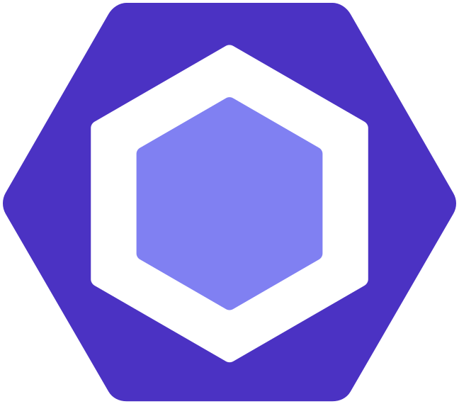
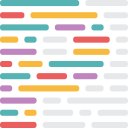
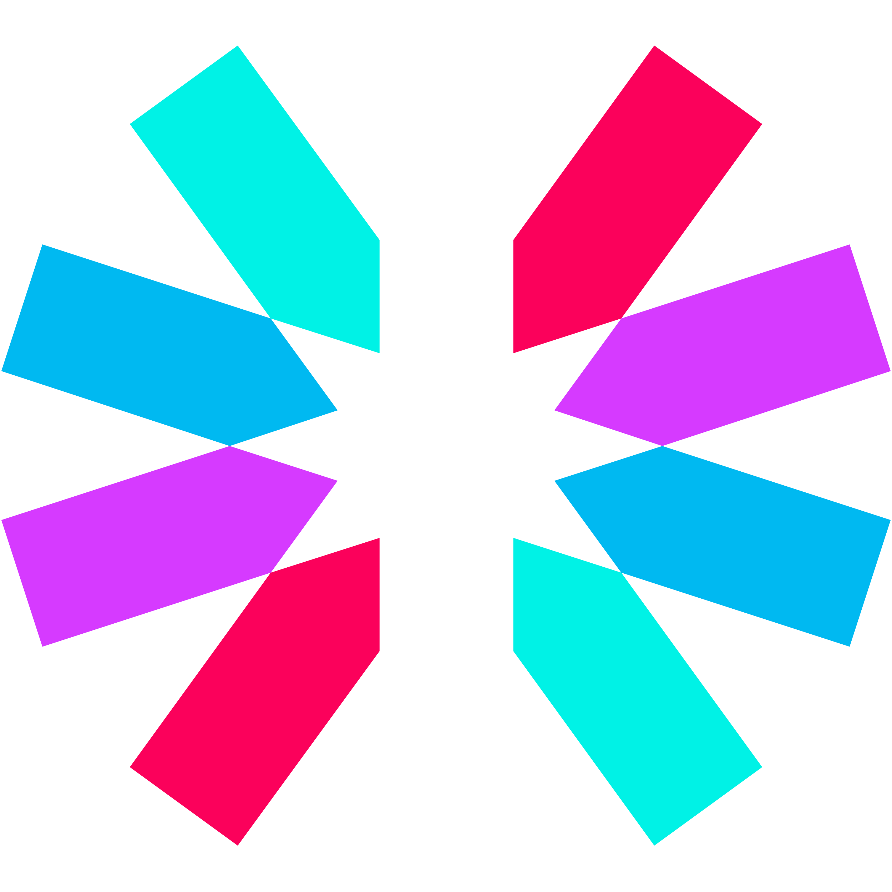
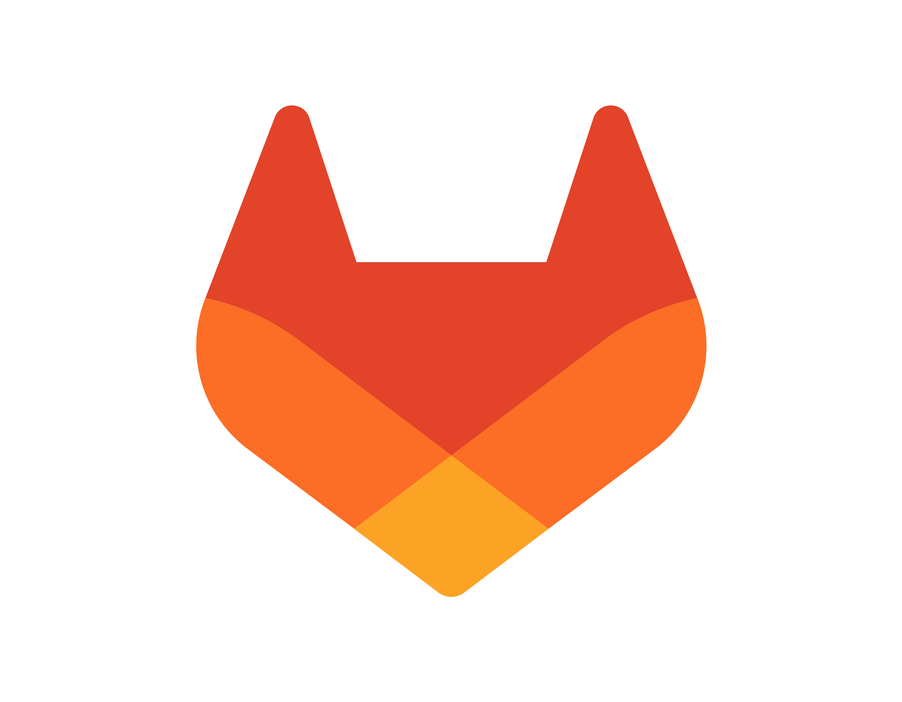
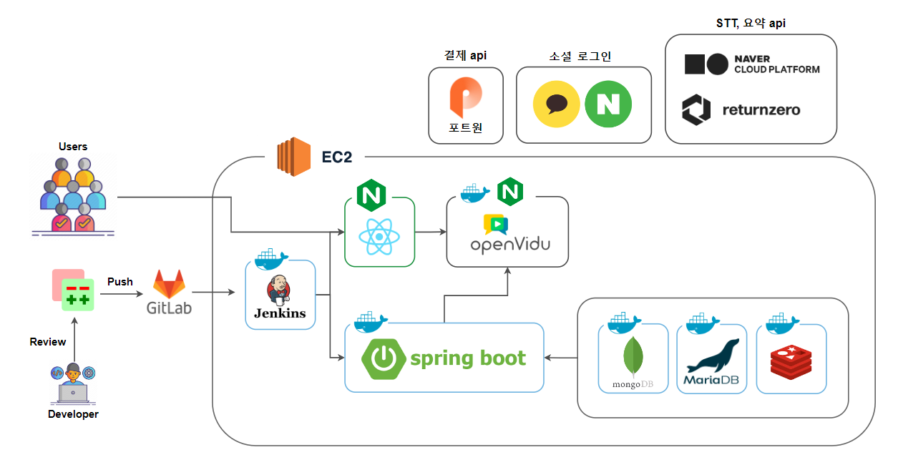

<div align="center">
  <br />
  
  <br />
  <h2>쉽고 합리적 거래를 위한 개인경매 서비스, BID</h2>
  <a href="https://i10d208.p.ssafy.io/">
   
  </a>
  <a href="https://www.notion.so/lshhh/BiD-ca99ff12c71748068f7e74a0bb251f32">
   
  </a>
  <a href="http://i10d208.p.ssafy.io:8081/api/swagger-ui/index.html">
   
  </a>

<b>SSAFY 공통 PJT TEAM 928</b>
<br />

</div>

## 목차

1. [**웹 서비스 소개**](#1)
1. [**기술 스택**](#2)
1. [**주요 기능**](#3)
1. [**프로젝트 구성도**](#4)
1. [**서비스 화면**](#5)
1. [**개발 팀 소개**](#6)
1. [**개발 기간 및 일정**](#7)
1. [**협업 컨벤션**](#8)

 <!-- 1. [**실행 방법**](#8) -->

<br />

<div id="1"></div>

## 🫶 웹 서비스 소개

**BID**는 개인간 물품을 라이브 경매를 통해 합리적인 가격으로 쉽고, 빠르게 거래할 수 있는 서비스입니다. <br/>
BID를 사용하여 실시간 라이브를 통해 희망 거래 물건의 현재 상태를 미리 확인할 수 있습니다. <br/>
또한 경매 및 역경매를 통해 판매자와 구매자 모두 합리적인 가격에 거래 가능합니다. <br/>

[<h3>BID 바로 가기</h3>](https://i10d208.p.ssafy.io/)

<br/>

<div id="2"></div>

## 🛠️ 기술 스택

### Frontend

<div>
<a href="https://reactjs.org/" target="_blank"></a>  
<a href="https://www.w3schools.com/css/" target="_blank"></a>  
<a href="https://en.wikipedia.org/wiki/HTML5" target="_blank"></a>  
<a href="https://www.typescriptlang.org/" target="_blank"></a>  
<a href="https://www.tailwindcss.com/" target="_blank"></a>

<a href="https://tanstack.com/query/latest/docs/framework/react/overview" target="_blank"></a>
<a href="https://openvidu.io/" target="_blank"></a>
<a href="https://stomp-js.github.io/" target="_blank"></a>
<a href="https://axios-http.com/kr/docs/intro" target="_blank"></a>
<a href="https://zustand-demo.pmnd.rs/" target="_blank"></a>

<a href="https://eslint.org/" target="_blank"></a>
<a href="https://prettier.io/" target="_blank"></a>
<a href="https://vitejs.dev/" target="_blank"></a>

</div>
</td><td valign="top" width="33%">
<br/>

### Backend

<div> 
<a href="https://www.java.com/" target="_blank"></a> 
<a href="https://docs.spring.io/spring-framework/docs/3.0.x/reference/expressions.html#:~:text=The%20Spring%20Expression%20Language%20(SpEL,and%20basic%20string%20templating%20functionality." target="_blank"></a>   
<a href="https://hibernate.org/" target="_blank"></a>   
<a href="https://mariadb.org/" target="_blank"></a>  
<a href="https://www.mongodb.com/" target="_blank"></a>

<a href="https://redis.io/" target="_blank"></a>
<a href="https://swagger.io/" target="_blank"></a>
<a href="http://www.jasypt.org/" target="_blank"></a>
<a href="https://spring.io/projects/spring-security" target="_blank"></a>
<a href="https://openvidu.io/" target="_blank"></a>
<a href="https://stomp-js.github.io/" target="_blank"></a>

</div>

</td><td valign="top" width="33%">
<br/>

### DevOps

<div>  
<a href="https://aws.amazon.com/" target="_blank"></a>  
<a href="https://www.docker.com/" target="_blank"></a>  
<a href="https://www.nginx.com/" target="_blank"></a>  
<a href="https://www.jenkins.io/" target="_blank"></a>  
</div>

</td><td valign="top" width="33%">
<br/>

### Tools

<div> 
<a href="https://www.notion.so/" target="_blank"></a>
<a href="https://about.gitlab.com/" target="_blank"></a>
<a href="https://www.atlassian.com/ko/software/jira" target="_blank"></a>
<a href="https://www.gerritcodereview.com/" target="_blank"></a>
<a href="https://mattermost.com/" target="_blank"></a>
</div>

<br/>

<div id="3"></div>

## 💡 주요 기능

| 기능               | 내용                                                                                                                                                             |
| :----------------- | :--------------------------------------------------------------------------------------------------------------------------------------------------------------- |
| 실시간 라이브 방송 | 경매와 역경매 글을 작성하고, 예정된 라이브 시간이 되면 실시간 라이브 서비스를 통해 자신의 물건을 판매, 구매 할 수 있습니다. 라이브 방송 중 채팅 또한 가능합니다. |
| 실시간 1:1 채팅    | 즉시 구매나 낙찰을 통해 거래가 확정되면 1:1 채팅방이 생성되고 1:1 채팅을 통해 상대방과 대화할 수 있습니다.                                                       |
| 알림 서비스        | 관심있는 거래를 등록하고, 해당 거래의 라이브 방송 전 알림을 받을 수 있습니다. 또한 참여한 거래에 대해 낙찰 시 알람을 받을 수 있습니다.                           |
|                    |

<br/>

<div id="4"></div>

## 📂 프로젝트 구상도



<br/>

<div id="5"></div>

## 🖥️ 서비스 화면

<!--
| 메인페이지 | 카테고리 및 필터링 기능 |    |
| ---------- | ------- | ------- |
| 테스트1    | 테스트2 | 테스트3 | -->

<br />

<div id="6"></div>

## 🧑🏻‍💻 개발 팀 소개

<table>
<tr>
<td align="center">FE</td>
<td align="center">FE</td>
<td align="center">FE</td>
<td align="center">BE</td>
<td align="center">BE</td>
<td align="center">BE</td>
</tr>
  <tr>
    <td align="center" width="120px">
      <a href="https://github.com/rosielsh" target="_blank">
        
      </a>
    </td>
    <td align="center" width="120px">
      <a href="https://github.com/hyun812" target="_blank">
        
      </a>
    </td>
    <td align="center" width="120px">
      <a href="https://github.com/minnnnnk0" target="_blank">
        
      </a>
    </td>
    <td align="center" width="120px">
      <a href="https://github.com/HeewonYoun" target="_blank">
        
      </a>
    </td>
    <td align="center" width="120px">
      <a href="https://github.com/Henry-Cha" target="_blank">
        
      </a>
    </td>
    <td align="center" width="120px">
      <a href="https://github.com/TutiTuti" target="_blank">
        
      </a>
    </td>
    
  </tr>
  <tr>
    <td align="center">
      <a href="https://github.com/hafnium1923" target="_blank">
        이수화
      </a>
    </td>
     <td align="center">
      <a href="https://github.com/wzrabbit" target="_blank">
       이승현
      </a>
    </td> 
     <td align="center">
      <a href="https://github.com/suyoungj" target="_blank">
       최민경
      </a>
       <td align="center">
      <a href="https://github.com/pilyang" target="_blank">
        윤희원
      </a>
    </td>
     <td align="center">
      <a href="https://github.com/the9kim" target="_blank">
       차성원
      </a>
    </td> 
     <td align="center">
      <a href="https://github.com/sh111-coder" target="_blank">
       최용수
      </a>
  </tr>
</table>

<br />

<div id="7"></div>

## 🗓️ 개발 기간 및 일정

24.01.03. ~ 운영 관리 중

<!-- <br />

<div id="7"></div>

## 실행 방법 -->

<br />

<div id="8"></div>

## ⚙️ 협업 컨벤션

### Commit

```
type: #[issueNumber] - 커밋 내용 최대 50자
> 띄우기
커밋 설명(이건 선택)
```

**header type**

```
feat: 새로운 기능을 추가
fix: 버그 수정 또는 기능에 대한 큰 변화와 결과에 변화가 있을 때
docs: 문서 관련 커밋
refactor: 기능에 대한 변화 없이 리팩토링
style: 코드 스타일 변경(formatting, missing semi colons, …)
test: 테스트 관련 커밋
chore: 기타 커밋, 환경설정
init: 프로젝트 생성
```

**예제**

```
feat: 로그인 API 구현 #[이슈키] #[상태]
```

### Branch

**1. branch 종류**

-   서비스 출시 : main
-   개발 : develop
-   **기능 개발 : feature**

**2. feature branch 명**

```
front : feature/[지라 스토리 번호]/fe
back : feature/[지라 스토리 번호]/be
```
